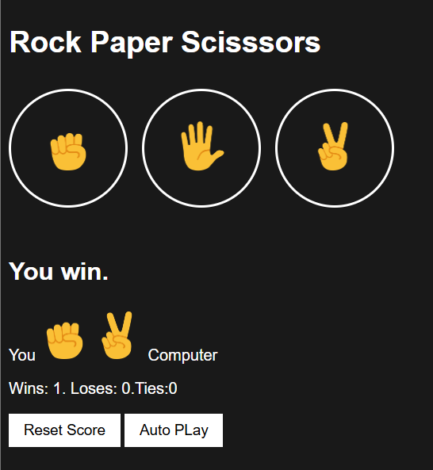

# rock-paper-scissors
# Rock Paper Scissors Game

A simple Rock Paper Scissors game built using HTML, CSS, and JavaScript. This project was created to practice JavaScript fundamentals such as DOM manipulation, event handling, local storage, and game logic.

## Features

* Play Rock, Paper, Scissors against the computer
* Random computer move generation
* Real-time game result display
* Score tracking (Wins, Losses, Ties)
* Score persistence using Local Storage
* Reset Score button
* Auto Play mode (plays automatically every second)
* Keyboard shortcuts:

  * R → Rock
  * P → Paper
  * S → Scissors
* Responsive and interactive user interface

## Technologies Used

* HTML5
* CSS3
* JavaScript (ES6)

## How It Works

1. The player selects Rock, Paper, or Scissors.
2. The computer randomly generates a move.
3. The game compares both moves and determines the winner.
4. Scores are updated and saved in the browser's Local Storage.
5. The saved score remains available even after refreshing the page.

## Keyboard Controls

| Key | Action        |
| --- | ------------- |
| R   | Play Rock     |
| P   | Play Paper    |
| S   | Play Scissors |

## Learning Outcomes

Through this project, I practiced:

* JavaScript functions
* Conditional statements
* DOM manipulation
* Event listeners
* Template literals
* Local Storage
* Timers using `setInterval()`
* Arrow functions
* Code organization and debugging

## Future Improvements

* Add sound effects
* Add game animations
* Add dark/light mode
* Display match history
* Improve mobile responsiveness

## Screenshot

## Author

Akash Sonowal

This project was built as part of my JavaScript learning journey.
